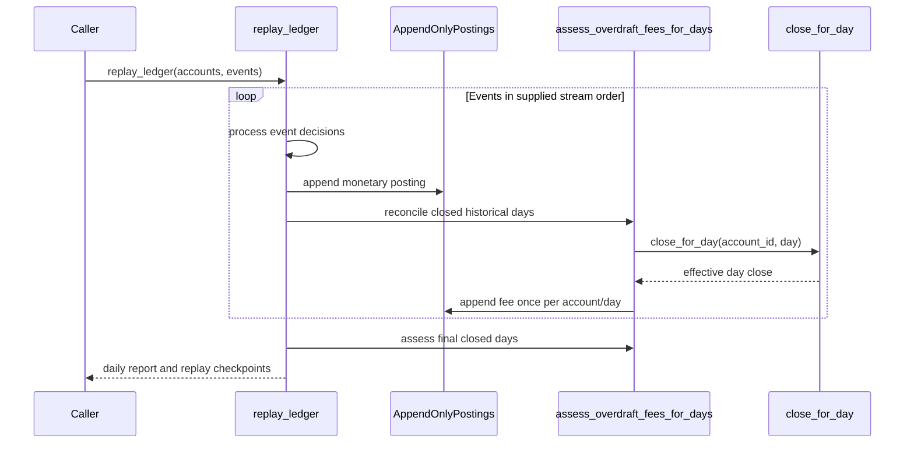
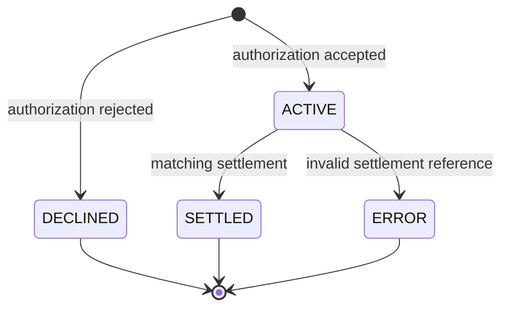

# 🧾 In-Memory Ledger Core


Deterministic, append-only ledger replay for a six-day challenge window with:
- value-dated postings,
- authorization holds and settlements,
- backdated debit + compensating reversal,
- daily overdraft fee assessment,
- per-currency precision and interest capitalization.

## ✨ Why this implementation

This project intentionally separates:
- **stream-order facts** (authorization decisions, validation, errors), and
- **value-date effects** (historical closes, fees, and interest bases).

A key debugging insight from follow-up review:
- the original fixture (E1–E10) was not enough to distinguish an implementation that charged fees on **transient intraday negatives** from one that charged fees on **true end-of-day closes**;
- a smaller counterexample exposed the semantic bug, and the fee engine was corrected to assess only closed days.

## 🧠 Core rules implemented

- Append-only ledger postings; no mutation/deletion.
- Overdraft fee: AED `25.00`, once per account/day, only when that day’s closing ledger balance is negative.
- Daily interest: `0.04%` on positive closes only, rounded at account precision each day, capitalized once on Day 6 as the exact rounded-sum total.
- Precision: AED `2dp`, BHD `3dp`.
- Authorization approval checks available balance (`ledger - active_holds`) after proposed hold.

## 🚀 Quickstart

```bash
python3 -m venv .venv
source .venv/bin/activate
python -m pip install pytest
```

Run deterministic replay report:

```bash
python -m ledger_core
```

## ✅ Verification

Passing suite:

```bash
python -m pytest tests
```

Required intentionally failing known-red test:

```bash
python -m pytest tests_known_red/test_stream_order_sensitivity.py
```

## 📋 Assessment Checklist

- [x] In-memory only (no UI/web/db/persistence layers)
- [x] Stream replay in supplied order
- [x] Per-day printed output includes close, fees, auth states, errors
- [x] Rejected incorrect acceptance criteria documented in `REJECTED.md`
- [x] Constants and rationale documented in `NUMBERS.md`
- [x] Ambiguities and decisions documented in `AMBIGUITIES.md`
- [x] Timestamped incremental decisions documented in `WORKLOG.md`
- [x] One intentionally failing test, annotated, runnable separately
- [x] Replay checkpoints include pre-fee E7 historical closes for auditability

## 🧪 CI and artifacts

- CI workflow: `.github/workflows/ci.yml` (runs passing suite only).
- PR brief: `PR_DESCRIPTION.md`.
- Follow-up PR notes: `PR_NOTES.md`.
- Visual thought-process artifact: `docs/approach.html`.
- Architecture/production considerations: `ARCHITECTURE_DECISIONS.md`.
- Submission PDF: `docs/architecture-tradeoffs.pdf`.

## 📁 Project map

- `ledger_core/core.py` — replay engine and domain rules
- `ledger_core/fixtures.py` — challenge accounts/events
- `ledger_core/reporting.py` — renderers
- `tests/test_replay.py` — passing business invariant tests
- `tests_known_red/test_stream_order_sensitivity.py` — intentional failing design test

## 🧭 Flow diagrams




